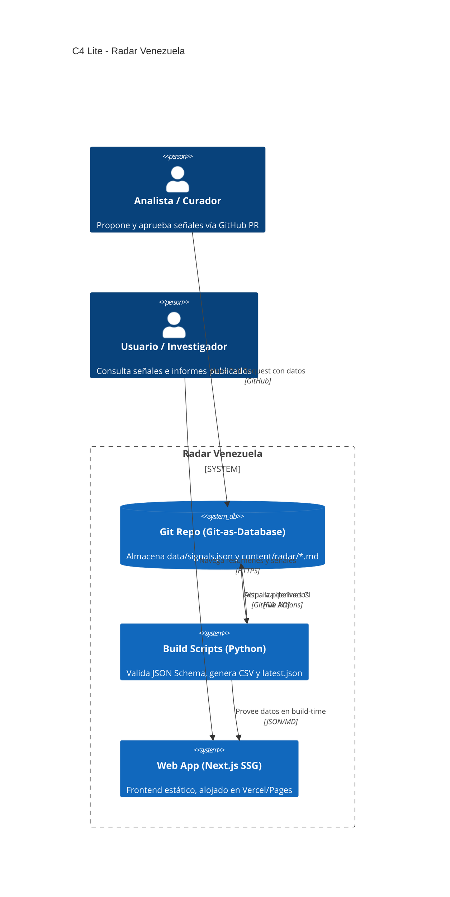

# Radar Venezuela

[](https://github.com/alej-developer/radar-venezuela/actions/workflows/ci.yml)
[](LICENSE)
[](data/LICENSE.md)

**Observatorio semanal de señales sobre Venezuela (FX, inflación, energía, sanciones, fintech).**  
Diseñado para inversores, fundadores y analistas que requieren información auditable, donde cada cifra publicada incluye invariablemente su fuente primaria, fecha de captura y enlace.

*Última edición del Radar: 7 de Octubre de 2026*

🇬🇧 *English summary below.*

> **Demo Pública:** [🔗 radarvenezuela.org](https://radar-venezuela.vercel.app/) *(Añade tu URL de Vercel/Pages)*

---

### Home (`/`)


### Explorador de Señales (`/signals`)


*(Reemplaza estas imágenes con pantallazos reales del frontend una vez desplegado).*

---

## Arquitectura (C4 Lite)

Radar Venezuela opera bajo el paradigma **Git-as-Database**. La infraestructura muta únicamente a través de Pull Requests, eliminando la necesidad de una base de datos relacional en la fase MVP y asegurando auditoría perfecta.



## Quickstart

Requisitos: `uv`, `node` (v22+).

```bash
# 1. Clonar el repositorio
git clone https://github.com/alej-developer/radar-venezuela.git
cd radar-venezuela

# 2. Instalar dependencias web y Python
npm install
uv sync

# 3. Compilar los datos en build-time
make release

# 4. Iniciar el servidor de desarrollo
make web
# > Ready on http://localhost:3000
```

## The "Weekly Radar Ritual" (Human-in-the-Loop)

Para garantizar la fiabilidad y evitar scrapers inestables que violen los TOS institucionales, la curaduría es humana, apoyada en tooling de automatización. Cada lunes, el lead analyst ejecuta:

```bash
make radar WEEK=YYYY-MM-DD
```

1. **Scaffold:** Genera el esqueleto de `content/radar/YYYY-MM-DD.md`.
2. **Revisión:** Imprime un checklist con las URLs institucionales (BCV, OFAC, OVF) para inspección manual rápida.
3. **Validación:** Tras añadir los datos a `data/signals.json`, el script de Python comprueba la integridad (JSON Schema) y que existan las URLs.
4. **Exportación:** Reconstruye el CSV y el JSON optimizado para la web.

Todo culmina en un Pull Request auditable.

---

## Contribuciones

Aceptamos aportes en forma de PR. Consulta los Issue Templates para:
- **[SIGNAL]**: Añadir una nueva señal factual y probada.
- **[SOURCE]**: Proponer una nueva fuente institucional.
- **[BUG]**: Reportar problemas en el código.

Lee siempre [`CONTRIBUTING.md`](CONTRIBUTING.md) antes de abrir un issue o PR.

## Licencia

- **Código:** [Apache-2.0](LICENSE). 
- **Datos y contenido editorial propios:** [CC BY 4.0](data/LICENSE.md).

## Aviso Legal

La información aquí expuesta **no constituye consejo de inversión**, legal o financiero. Los datos pertenecen a terceros (BCV, observatorios independientes, etc.) y pueden sufrir rezagos. Verifica siempre con la fuente original enlazada antes de tomar decisiones.

---

## English summary

**Radar Venezuela** is an open-source weekly radar of signals about Venezuela (FX, inflation, energy, sanctions). Designed for strict auditability, every claim ships with a primary source, capture date, and URL. It uses a **Git-as-Database** architecture with Python validation scripts and a static Next.js frontend for zero-cost hosting. Code is licensed under Apache-2.0.
