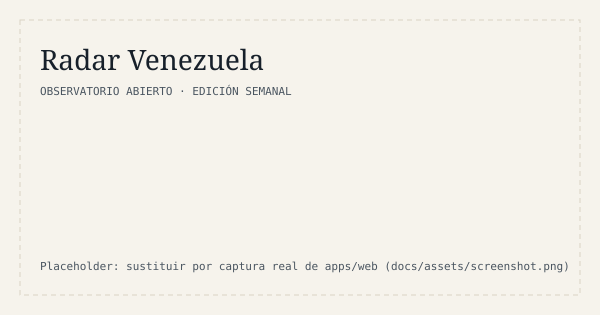

# Radar Venezuela

[](https://github.com/alej-developer/radar-venezuela/actions/workflows/ci.yml)
[](LICENSE)
[](data/LICENSE.md)

**Radar semanal de señales sobre Venezuela: FX, inflación, energía, sanciones/OFAC, fintech y pagos,
e-commerce e infraestructura digital. Cada cifra con fuente, fecha de captura y enlace.**

🇬🇧 *English summary below.*



## El problema

La información sobre Venezuela está dispersa y **las fuentes se contradicen**. Quien invierte, opera o envía
remesas necesita saber qué es un hecho, qué es un rango entre fuentes y qué es una hipótesis, sin ruido ni
opinión disfrazada de dato. Radar Venezuela publica ese resumen cada semana, de forma abierta y auditable.

No es un blog de opinión, ni un chatbot, ni un dashboard genérico. Ver [`docs/PRODUCT.md`](docs/PRODUCT.md).

## Principios

- Cada cifra lleva **fuente, fecha de captura y enlace**; el esquema rechaza lo que no los tenga.
- Tres tipos de afirmación: **Hecho**, **Rango entre fuentes** (≥ 2 fuentes) e **Hipótesis** (con premisas y
  criterios de refutación).
- Git es el registro de auditoría: datos, correcciones y contenido están versionados.

## Arquitectura en 5 líneas

1. Fuente de verdad: Markdown semanal (`content/radar/`) y `data/signals.json`.
2. Contrato único en `packages/schema` (JSON Schema) con espejos TypeScript y Pydantic.
3. `scripts/validate_signals.py` valida; `scripts/build_data.py` deriva `signals.csv` y `latest.json`.
4. `apps/web` (Next.js, export estático) lee `latest.json`; `apps/api` (FastAPI) expone consulta de solo lectura.
5. CI: ruff, mypy, pytest, validación del esquema, eslint, tsc y `next build`.

Detalle y decisiones en [`docs/ARCHITECTURE.md`](docs/ARCHITECTURE.md).

```text
.
├── apps/api/          FastAPI + Pydantic v2
├── apps/web/          Next.js (App Router) + TypeScript + Tailwind
├── packages/schema/   JSON Schema + tipos TS
├── content/radar/     ediciones semanales YYYY-MM-DD.md
├── data/              signals.json · signals.csv · latest.json
├── docs/              PRODUCT · ARCHITECTURE · DATA_DICTIONARY · SOURCES · ROADMAP
└── scripts/           build_data.py · validate_signals.py
```

## Cómo correr en local

Requisitos: [uv](https://docs.astral.sh/uv/) y Node.js 22 o superior.

```bash
git clone https://github.com/alej-developer/radar-venezuela.git
cd radar-venezuela

uv sync                                   # Python 3.12 + dependencias
npm install                               # dependencias web

uv run python scripts/validate_signals.py # valida data/signals.json
uv run python scripts/build_data.py       # regenera CSV y latest.json

uv run uvicorn radar_api.main:app --app-dir apps/api --reload   # http://127.0.0.1:8000/docs
npm run web:dev                                                  # http://localhost:3000
```

Verificación completa (la misma que CI):

```bash
uv run ruff check . && uv run ruff format --check .
uv run mypy apps/api scripts
uv run pytest
uv run python scripts/validate_signals.py && uv run python scripts/build_data.py --check
npm run web:lint && npm run web:typecheck && npm run web:build
```

## Cómo contribuir una señal

1. Localiza una fuente pública y anota la fecha en que la consultaste.
2. Añade la señal a `data/signals.json` (campos en [`docs/DATA_DICTIONARY.md`](docs/DATA_DICTIONARY.md)):

   ```json
   {
     "id": "ejemplo-de-id-estable",
     "edition": "AAAA-MM-DD",
     "domain": "fx",
     "indicator": "fx.nombre_indicador",
     "claim_type": "fact",
     "title": "Titular factual",
     "statement": "Enunciado en español neutro, verificable en la fuente.",
     "value": 0,
     "unit": "unidad y base",
     "observed_at": "AAAA-MM-DD",
     "sources": [
       { "name": "Nombre de la fuente", "url": "https://...", "captured_at": "AAAA-MM-DD" }
     ]
   }
   ```

   Los valores son de forma, no datos reales. `range` exige ≥ 2 fuentes; `hypothesis` exige `confidence`,
   `assumptions` y `falsifiers`.
3. Crea o actualiza `content/radar/AAAA-MM-DD.md` (parte de `_template.md`).
4. Ejecuta `build_data.py` y `validate_signals.py`, y abre un PR.

Guía completa: [`CONTRIBUTING.md`](CONTRIBUTING.md). Hoja de ruta: [`docs/ROADMAP.md`](docs/ROADMAP.md).

## Estado

v0.1: esqueleto. `data/signals.json` está vacío a propósito: no se publica ninguna cifra sin fuente, fecha de
captura y enlace. Aún no hay ingestión automática ni interfaz completa (ver hoja de ruta).

## Licencia

- **Código:** [Apache-2.0](LICENSE). Elegida por su concesión explícita de patentes y su claridad de atribución,
  adecuadas para que terceros e instituciones reutilicen el proyecto.
- **Datos y contenido editorial propios:** [CC BY 4.0](data/LICENSE.md). Los datos de terceros conservan su licencia.

## Cómo citar

Ver [`CITATION.cff`](CITATION.cff).

## Aviso legal

- **No es consejo de inversión**, financiero, legal ni fiscal. Es información con fines divulgativos.
- **Los datos son de terceros**: cada cifra pertenece a su fuente y puede contener errores, rezagos o
  revisiones. Verifica siempre en el enlace original.
- **Las sanciones (OFAC) y la regulación pueden cambiar** en cualquier momento; consulta siempre la fuente
  primaria vigente antes de operar.

---

## English summary

**Radar Venezuela** is an open-source weekly radar of signals about Venezuela: FX, inflation, energy,
sanctions/OFAC, fintech and payments, e-commerce and digital infrastructure. Every figure ships with its
source, capture date and link, and every claim is labelled as a **fact**, a **range across sources** or a
**hypothesis**.

- **Stack:** Python 3.12 + FastAPI + Pydantic v2; Next.js (App Router) + TypeScript + Tailwind; a shared
  JSON Schema contract; Markdown + JSON/CSV versioned in Git; GitHub Actions CI.
- **Run locally:** `uv sync && npm install`, then `uv run python scripts/validate_signals.py`,
  `uv run uvicorn radar_api.main:app --app-dir apps/api --reload` and `npm run web:dev`.
- **Contribute a signal:** see [`CONTRIBUTING.md`](CONTRIBUTING.md) (in Spanish) and
  [`docs/DATA_DICTIONARY.md`](docs/DATA_DICTIONARY.md).
- **License:** code under Apache-2.0; own data and editorial content under CC BY 4.0; third-party data keeps
  its original license.
- **Disclaimer:** not investment advice; data comes from third parties; OFAC sanctions and regulations can
  change at any time.
