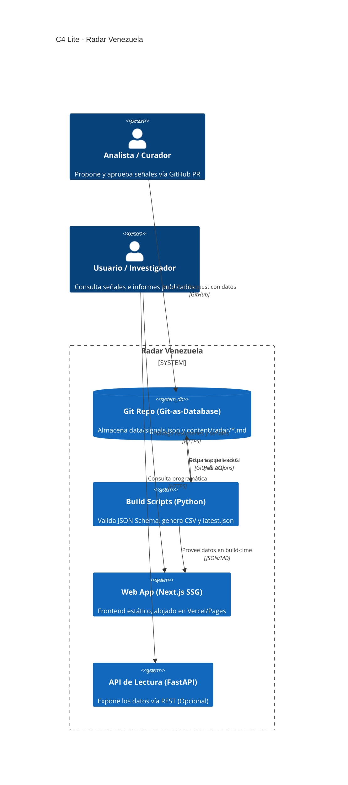

# Arquitectura

## Principio rector

**Git es la base de datos.** La fuente de verdad son archivos versionados (`content/radar/*.md` y
`data/signals.json`); todo lo demás se deriva de ellos de forma reproducible. El historial de commits es la
auditoría de cada cifra y de cada corrección.

## Vista general (C4 Lite)

## Componentes

| Componente | Responsabilidad | Tecnología |
|------------|-----------------|------------|
| `packages/schema` | Contrato único: JSON Schema + tipos TS | JSON Schema 2020-12, TypeScript |
| `apps/api` | Consulta de señales con filtros; espejo Pydantic del contrato | Python 3.12, FastAPI, Pydantic v2 |
| `apps/web` | Sitio público estático | Next.js App Router, TS estricto, Tailwind 4 |
| `scripts/` | Validación e derivación de datos | Python + jsonschema |
| `data/` | Datasets abiertos versionados | JSON, CSV |
| `content/radar/` | Ediciones semanales | Markdown |

## Contrato de datos

`packages/schema/signals.schema.json` es la fuente de verdad. Hay dos espejos: tipos TypeScript
(`packages/schema/src/index.ts`) y modelos Pydantic (`apps/api/radar_api/models.py`).
`apps/api/tests/test_schema_parity.py` verifica que JSON Schema y Pydantic aceptan y rechazan lo mismo.

Invariantes que el esquema hace cumplir: toda señal tiene al menos una fuente con `name`, `url` y
`captured_at`; los rangos exigen dos fuentes; las hipótesis exigen premisas y criterios de refutación.

## Decisiones y desviaciones del stack previsto

| Decisión | Motivo |
|----------|--------|
| **MVP estático + JSON; la API no es necesaria para publicar** | El volumen es de cientos de filas por año; un sitio estático es más barato, más rápido y más auditable. |
| **Sin SQLAlchemy ni Alembic todavía** | No hay estado mutable ni consultas relacionales. Se incorporan cuando haya un caso de uso medido (ver `ROADMAP.md`); los modelos Pydantic ya separan el contrato del almacenamiento. |
| **uv para Python, npm workspaces para JS** | uv cubre el workspace Python. Se usa npm (incluido con Node) en lugar de pnpm para reducir prerrequisitos; migrar a pnpm es trivial. |
| **Tipos TS escritos a mano** | Con un esquema de ~10 campos, un generador añade más complejidad que valor; la paridad se vigila por tests en el lado Python. |
| **Sin fixtures reales en `data/`** | `data/signals.json` arranca vacío para no publicar cifras sin fuente. Los fixtures sintéticos viven en `packages/schema/fixtures/`. |
| **Sin autenticación de escritura** | La API es de solo lectura en esta etapa (MVP). Las señales entran exclusivamente por pull request al repo (Git as Database). |

## Despliegue previsto

- **Web**: `next build` genera `apps/web/out/`; se publica en Vercel o GitHub Pages.
- **Datos**: `data/*.json|csv` accesibles vía URL raw de GitHub o desde el propio sitio.
- **API**: opcional; contenedor con `uvicorn` (Railway/Fly) cuando se requiera.

## Seguridad

Sin cuentas ni datos personales. La API es de solo lectura y no ejecuta entrada del usuario más allá de
filtros tipados. Ver [`SECURITY.md`](../SECURITY.md).
